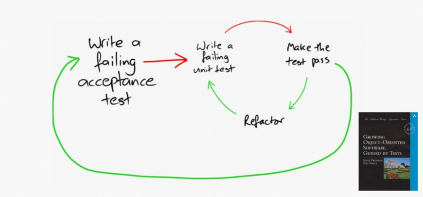

# Brûlez-moi cette pyramide de tests !
__Thomas PIERRAIN__ (__[use case driven](https://twitter.com/tpierrain)__ on twitter)

> __TL;DR: après plus de 12 ans de pratique du TDD, j'ai fini pas adopter presque exclusivement une forme d'*Outside-in* qui me fait écrire plus de tests d'acceptance que de tests unitaires. Je ne suis donc pas du tout à l'aise avec la pyramide de tests classique que nombreuses personnes revendiquent encore aujourd'hui. Petite visite guidée -avec du code- pour vous montrer comment ça s'articule au quotidien.__

## Disclaimers
Pardonnez-moi ce titre un peu raccoleur, mais j'avais vraiment envie d'aborder ce sujet avec un maximum de monde alors ;-)

En fait, celà fait longtemps que je veux écrire cet article sur ma pratique du TDD et de récentes publications et discussions sur le sujet m'ont finalement décidées à l'écrire. Je ne prétends en aucun cas expliquer aux gens comment ils doivent bosser, c'est plutôt une tentative pour montrer comment moi je pratique le TDD avec autant de plaisir que de succès depuis quelques années maintenant. Des amis m'ont déconseillés de le faire en pretextant que cela pourrait être mal interpreté par des débutants. Je tiens donc ici à préciser que cette façon de coder est la conséquence de plus de 12 ans de pratique du TDD en entreprise (et en open source). Et c'est bien  parce que j'ai pratiqué le TDD by-the-book(s) pendant toutes ces années, mais aussi parce que je suis tombé dans à peu près tous les pièges possibles autours de cette discipline, que j'en suis arrivé à cette forme qui prends -vous le verrez- un peu de liberté avec la technique classique. Mais comme le dit Kent BECK:

> “There are three phases to XP, out-of-the-box, adaptation, and transcendence” (Kent BECK)

Je ne sais pas si j'en suis actuellement à la phase d'adaptation ou déjà à la phase de transcendence, mais je sais juste que cela fonctionne très bien pour moi (pour être zen et efficace au travail). __Si vous débutez la pratique du TDD en revanche, je vous pousserai plutôt à ne pas me suivre tout de suite et à systématiser plutôt une approche *by-the-book*__ (*out-of-the-box* pour reprendre les termes de Kent BECK).

## Le code en support
Pour décrire ma façon de travailler et mon interprétation personnelle de la double boucle de l'outside-in TDD, je me suis dit qu'il n'y aurait pas mieux que du code pour accompagner mes propos. J'ai donc repris un kata que j'ai eu à faire il y a quelques mois en C# pour m'en servir de base pour mes explications. Celui-ci ayant été réalisé dans des conditions un peu particulières (plutôt tard le soir, et interrompu par de nombreux biberons) et sans savoir que j'allais le  publier, je vous demanderai un peu d'indulgence quant aux design et aux termes métiers un peu approximatif (je découvrais ce sujet et ce kata pour la 1ere fois). Le véritable intérêt de montrer ce code ici est pour l'illustration des types de tests et de cheminement que je prends pour faire "émerger" mon logiciel.

## Quelques notes sur l'Outside-in TDD
Quand je dois décrire rapidement comment je travaille à quelqu'un avec qui je vais pairer, j'ai l'habitude de dire que je pratique l'outside-in TDD (appellé aussi London-School of TDD, mais aussi la "*double-boucle*").

Contrairement à __l'*approche classique du TDD*__ avec laquelle j'ai commencée, la pratique de __l'*Outside-in TDD*__ me force à considérer mon système (ex: une WEB API, un service, etc.) __depuis l'extérieur et comme une grosse boite noire__. Celle-ci est vide pour commencer, et __on va faire emerger à la fois ses contours (APIs) et son comportement en y écrivant petit à petit des tests d'acceptance__. On parle de double-boucle ici car le workflow sera le suivant: 

__RED (acceptance test) - puis pleins de { RED - GREEN - REFACTOR au niveau (unit tests) } - GREEN (acceptance test) - REFACTOR (acceptance test)__ et on recommence ensuite avec le prochain test d'acceptance sur la boite noire.

## Acceptance ?
Par test d'acceptance j'entends un __test gros-grain, qui va porter sur l'ensemble de mon système à l'exception des technnologies pour communiquer avec l'extérieur__ (persistance, middlewares, stack HTTP, etc.). __Ce n'est donc pas un test d'intégration__. Attention également, en lisant "Acceptance", certains d'entre-vous penseront tout de suite à du Gerkhin. Ce n'est pas mon cas, car je ne paie le prix de la surchouche correspondante (specflow /  Cucumber) que si et seulement si le métier est à portée de main et qu'il est à l'aise avec ce format (assez rare en définitive). Mes test d'acceptance sont donc __comme des tests unitaires mais qui portent sur le système dans son ensemble au lieu de porter sur des petites parties du système__. 

__Dans tous les cas, mes tests ne sont que des tests de comportements !__ et ne sont pas liés à des détails d'implémentations (une des nombreuses erreurs que j'ai pu faire au début de mon expérience du TDD, rendant mes tests pénibles car très fragiles à chaque fois que je voulais changer quelque chose dans mon implémentation ;-( 

## Un Outside-in particulier ?
__Avec le temps et l'expérience, je me suis rendu-compte que certaines petites boucles au niveau "unitaire" que je systématisais avant ne me paraissaient plus du tout indispensables.__ Il n'y a pas de règle pour savoir (ou en tout cas je ne l'ai pas encore identifiée), c'est plutôt lié au contexte, à la difficulté de la tâche en cours pour faire réussir le test d'acceptance, et à la clairvoyance de mon esprit au moment où je code (dans tout cet article, il faut entendre "coder" au sens large, en incluant le Design donc).

Bon. Le mieux pour clarifier tout ça, serait de commencer à regarder un peu de code, non ?

## Le kata utilisé
Le kata mentionné plus haut est le __[Train Reservation d'Emily BACHE](https://github.com/emilybache/KataTrainReservation/blob/master/README.md)__. L'objectif ? coder une application qui va permettre à des voyageurs de réserver des places dans un train dont ils connaissent déjà l'identifiant. Etant donné un train et sa topologie (récupérée auprès d'une Web API externe), le système à construire a pour but d'identifier les places les plus adaptées à la demande du voyageur en respectant quelques règles métiers du genre :
 - Remplir les trains jusqu'à 70% maximum de leur capacité
 - Attribuer toutes les places demandées pour une réservation dans la même voiture

Pour ce faire, notre système doit composer avec quelques back-ends de l'opérateur historiques des trains (genre SNCF):
 - Une Web API qui fournit la topologie d'un train à partir de son identifiant
 - 

---
English version:

# Rid me of that testing pyramid!