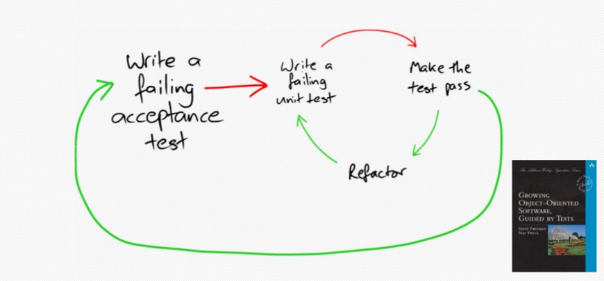

# Virez-moi cette pyramide de tests !
__Thomas PIERRAIN__ (__[use case driven](https://twitter.com/tpierrain)__ on twitter)

> __TL;DR:__ après plus de 12 ans de pratique du TDD, j'ai fini par adopter presque exclusivement une forme d'*Outside-in* "économe" qui me fait écrire plus de tests d'acceptation que de tests unitaires. Je ne suis donc pas du tout à l'aise avec la pyramide de tests classique que de nombreuses personnes revendiquent encore aujourd'hui et qui préconise d'avoir plus de tests unitaires que de tests d'acceptation. Cette série d'articles est une petite visite guidée dans ma tête -et avec du code en soutient - pour vous montrer comment je pratique cette forme d'Outside-In TDD au quotidien.

# Episode 1: définitions, objectifs et premiers tests

## Disclaimers
Pardonnez-moi ce titre un peu racoleur avec la pyramide, mais j'avais vraiment envie d'aborder ce sujet avec un maximum de monde alors ;-)

En fait, cela fait longtemps que je veux écrire cet article sur ma pratique particulière du TDD et de récentes publications et discussions sur le sujet m'ont finalement décidées à l'écrire. Je ne prétends en aucun cas expliquer aux gens comment ils doivent bosser, c'est plutôt une tentative pour montrer comment moi je pratique le TDD __avec autant de plaisir que de succès depuis quelques années maintenant__. Des amis m'ont déconseillé de le faire en prétextant que cela pourrait être mal interprété par des débutants. Je tiens donc ici à préciser que cette façon de coder est la conséquence de plus de 12 ans de pratique du TDD en entreprise (et en open source). Et c'est bien parce que j'ai pratiqué le TDD by-the-book(s) pendant toutes ces années, mais aussi parce que je suis tombé dans à peu près toutes les erreurs d'interprétations et tous les pièges possibles autour de cette discipline, que j'en suis arrivé à cette forme qui prends -vous le verrez- un peu de liberté avec la technique classique. Mais comme le dit Kent BECK:

> “There are three phases to XP, out-of-the-box, adaptation, and transcendence” (Kent BECK)

Je ne sais pas si j'en suis actuellement à la phase d'adaptation ou déjà à la phase de transcendance en ce qui concerne le TDD, mais je sais juste que cela fonctionne très bien pour moi (pour être à la fois zen et efficace au travail). __Si vous débutez la pratique du TDD en revanche, je vous pousserai plutôt à systématiser une approche *by-the-book*__ (*out-of-the-box* pour reprendre les termes de Kent BECK) avant de faire -sans doute un jour- votre propre adaptation.

## Le code en support

Pour décrire ma façon de travailler et mon interprétation personnelle de la double boucle de l'outside-in TDD, je me suis dit qu'il n'y aurait pas mieux que du code pour accompagner et clarifier mes propos. J'ai donc repris un kata que j'ai eu à faire il y a quelques mois en C# pour m'en servir de base pour mes explications. Celui-ci ayant été réalisé dans des conditions un peu particulières (plutôt tard le soir, et interrompu par de nombreux câlins/biberons) et sans savoir que j'allais le publier, je vous demanderai un peu d'indulgence quant aux design et aux termes métiers un peu approximatifs (je découvrais le sujet et ce kata pour la 1ere fois). L'intérêt de montrer ce code est surtout pour illustrer les tests que j'écris, ceux que je n'écris plus, et le type de cheminement que je prends pour faire "émerger" mes softs.

## Quelques notes sur cet Outside-in frugal ;-)
Quand je dois décrire rapidement à quelqu'un avec qui je vais pairer comment je travaille, j'ai l'habitude de dire que
> je pratique l'outside-in TDD 

Il y a de nombreuses formes et approches du TDD, mais j'aime à retenir ces 2 principales :
1. La forme classique
2. L'outside-in TDD (appellé aussi "*London-School*" ou "*double-boucle*")

Dans la forme classique, on part du centre du système (pour cela qu'on parle également d'*inside-out*) en se concentrant au début sur de petites implémentations que l'on va consolider et assembler au fur et à mesure pour arriver au bout d'un moment à constituer le système global souhaité (si tout se passe bien en route ais-je envie de rajouter). 

### Pour éviter le décrochage

De mon point de vue, il y a un vrai risque de "décrochage" par rapport au besoin final avec l'approche classique du TDD. En effet, si on a mal jugé la situation (en imaginant une trajectoire vers le résultat final dans notre tête, qui n'est pas la bonne finalement) ou si on se laisse distraire voire perdre en route (et qui ne s'est pas laissé grisé par l'effet cathédrale/usine à gaz quand il était plus jeune...), on peut galérer et tâtonner un peu plus que nécessaire avec cette approche.

C'est pour cette raison donc, que j'ai arrêté de faire du "classique" sur mes projets depuis quelques années, car j'y ai trouvé le risque de faire des trucs qui ne soient pas exactement alignés avec le besoin réel (voire de tomber dans le piège du "modélisme" quand on reste trop longtemps *au centre* de notre système). Un vrai risque *d'effet tunnel* par rapport à l'objectif final dans tous les cas.

### De l'extérieur, vers l'intérieur (tiens donc, c'est comme avec l'archi hexagonale ;-)
Contrairement à l'*approche classique*, la pratique de __l'*Outside-in TDD*__ me force elle à __considérer mon système__ (ex: une WEB API, un service, etc.) __depuis l'extérieur, comme une grosse boite noire__. Celle-ci est vide pour commencer, et __on va faire emerger à la fois ses contours (APIs) et son comportement en y écrivant petit à petit des tests d'acceptation__. 

On parle de double-boucle ici car le workflow sera le suivant : 



__RED (acceptance test) - puis pleins de { RED - GREEN - REFACTOR au niveau (unit tests) } - GREEN (acceptance test) - REFACTOR (acceptance test)__ et on recommence ensuite avec le prochain test d'acceptation sur la boite noire.

L'intérêt principal de cette technique est d'éviter de se perdre en route dans notre implémentation. Cela est rendu possible par __nos tests d'acceptation__ qui __vont cadrer et cristalliser dès le départ les contours et les conditions du succès de notre système__. En ce qui me concerne, ça me pousse à rester concentré sur l'objectif final en m'évitant de dévier ou de m'éparpiller en route face à ce juge de paix minimaliste (le __[YAGNI](https://en.wikipedia.org/wiki/You_aren%27t_gonna_need_it)__ d'XP).

### acceptation ? Cornichon toi même !
Par test d'acceptation j'entends un __test gros-grain, qui va porter sur l'ensemble de mon système à l'exception des technologies pour communiquer avec l'extérieur__ (j'exclue donc la persistance, les middlewares et autres stacks HTTP). __Ce n'est donc pas un test d'intégration__. Attention également, en lisant "*acceptation*", certains d'entre vous penseront tout de suite à du Gerkhin (le formalisme *Given-When-Then...*). Ce n'est pas mon cas, car je ne paie en général le prix de la surcouche correspondante (specflow /  Cucumber) que si et seulement si le métier est à portée de main et qu'il est à l'aise avec ce format (ce qui est assez rare en définitive). Comme vous le verrez dans les exemples ci-dessous, mes test d'acceptation sont donc __écrits comme des tests *unitaires* mais ils portent sur le système dans son ensemble au lieu de porter sur des toutes petites parties de celui-ci__.

### Le bon comportement
__Dans tous les cas, mes tests ne sont que des tests de comportements !__ et ne sont pas liés à des détails d'implémentations (une des nombreuses erreurs que j'ai pu faire au début de mon expérience du TDD, rendant mes tests pénibles car très fragiles à chaque fois que je voulais changer quelque chose dans mon implémentation ;-( 


### Un Outside-in particulier ?
__Avec le temps et l'expérience, je me suis rendu-compte que certaines petites boucles au niveau "unitaire" que je systématisais avant ne me paraissaient plus du tout indispensables.__ Il n'y a pas réellement de règle pour savoir si j'écris un test unitaire ou pas (ou en tout cas je ne l'ai pas encore identifiée), c'est plutôt intuitivement lié au contexte, à la difficulté de la tâche en cours pour faire réussir le test d'acceptation, et à la clairvoyance de mon esprit au moment où je code (dans tout le reste de cet article il faudra entendre "coder" au sens large, c.ad. en y incluant le Design). __Par contre si je galère sur le moindre aspect de l'implémentation, c'est un signal pour écrire fissa un test unitaire correspondant.__

Bon. Le mieux pour clarifier tout ça, serait de commencer à regarder un peu de code, non ?

## Le kata utilisé
Le kata mentionné plus haut est le __[Train Reservation d'Emily BACHE](https://github.com/emilybache/KataTrainReservation/blob/master/README.md)__. 

L'objectif ? coder une application qui va permettre à des voyageurs de réserver des places dans un train dont ils connaissent déjà l'identifiant. Etant donné un train et sa topologie (récupérée auprès d'une Web API externe), le système à construire a pour but d'identifier les places les plus adaptées à la demande de réservation du voyageur en respectant quelques règles métiers du genre :
 - Remplir les trains jusqu'à 70% maximum de leur capacité
 - Attribuer toutes les places demandées pour une réservation dans la même voiture

Pour ce faire, notre système doit composer avec quelques back-ends de l'opérateur historiques des trains (genre SNCF), à savoir : 
 - Une Web API qui fournit la topologie d'un train à partir de son identifiant (__Train Data Service__)
 - Une Web API qui ne fournit que des identifiants uniques valables de Booking Reference (contrainte réglementaire semble-t-il) (__Booking Reference Service__)
 - Une Web API qui permet de réserver officiellement les places que notre système aura identifiées dans un train donné (__Train Data Service__). Il est à noter qu'il s'agit de la même API que celle qui fournit la topologie des trains (un choix contestable de l'opérateur historique, mais avec lequel on va devoir composer)


De notre côté, __c'est le Train Reservation Service que nous devons implémenter__. 

Prêts ? Je vous propose qu'on commence par un premier test d'acceptation. Ah si ! avant que je n'oublie : je n'ai pas conservé tous mes baby steps dans git, donc le code que je présenterai ici (ou que vous pouvez aller voir dans les commits de ce repo) apparaitra en bloc un peu plus gros que ceux rajoutés à l'époque. Mais ce sera largement suffisant pour illustrer mon point quant à ma pratique de l'Outside-in.

## 1er test d'acceptation

Pour mes premiers pas, je m'attaque en général au cas qui me parait le plus simple. En l'occurrence ici, le cas où on veut réserver des sièges dans un train vide (avec toutes les places de disponibles donc). Je réfléchi donc 30 secondes, et pars sur un nom de test qui va m'aider à clarifier mon intention pour celui-ci : 

```c#
    Should_reserve_seats_when_unreserved_seats_are_available()
```

Ensuite, j'ai fait comme à mon habitude une forme un peu particulière de __[TDD as if you meant it](https://gojko.net/2009/02/27/thought-provoking-tdd-exercise-at-the-software-craftsmanship-conference/)__. Cela signifie que je laisse l'implémentation émergente dans le même fichier que celui du test le temps d'y voir un plus clair, et de le déplacer ensuite dans un second temps ce code d'implémentation dans les bons projets/répertoires. C'est pour cette raison que mon 1er fichier de tests ci-dessous contient l'intégralité du test + implémentations nécessaires dans ces premières minutes.

Bien entendu, c'est un test qui échoue que j'ai commencé à écrire (__RED__-GREEN-REFACTOR). __Ecrire des tests qui échouent avant de commencer l'implémentation est un conseil qui reste valable quelque soit votre niveau de pratique du TDD.__


#### Des raccourcis, encore des raccourcis...
Cet article ne rendra malheureusement pas bien compte de la dynamique super fluide de génération du code d'implémentation au fil des lignes du test que j'écris. Je me sers pour cela très intensivement des raccourcis clavier __Alt-Enter__ de R# (pour pouvoir créer des types et des méthodes à la volée) et de __Ctrl-Shift-Backspace__ de Visual Studio (pour pouvoir revenir au contexte précédent, c.ad. de la ligne du test d'où je suis parti lorsque mon curseur s'est laissé embarquer dans la nouvelle classe/méthode générée par R#). 

#### Un exercice de Design
Ce premier test d'acceptation est déjà un exercice de Design pour mon système à venir. J'y fait émerger le concept de __TicketOffice__ (le coeur de mon système à venir), de __ReservationRequest__ mais aussi des 2 services externes (__BookingReferenceProvider__ et __TrainDataProvider__) dont mon système va avoir besoin pour travailler et que je commence ici à __[stubber](./Appendix.md#stub)__ à l'aide de la libraire [NSubstitute](http://nsubstitute.github.io/).

Au final, j'obtiens le code suivant qui constitue les prémices de ma boite noire TrainReservation/TicketOffice. Il est important de noter ici que 90% du walking skeleton (c.ad. de mon implémentation vide qui retourne) est générée automatiquement par le plugin R# et mon usage intensif __de son raccourci clavier Alt-Enter__. Ca fait beaucoup de code ici, mais c'est très rapide à générer : 

```c#

using KataTrainReservation;
using NFluent;
using NSubstitute;
using NUnit.Framework;

namespace TrainReservation.Tests.Acceptance
{
    [TestFixture]
    public class TicketOfficeTests
    {
        [Test]
        public void Should_reserve_seats_when_unreserved_seats_are_available()
        {
            // Setup stubs
            var bookingReferenceProvider = Substitute.For<IProvideBookingReferences>();
            string expectedBookingId = "75bcd15";
            bookingReferenceProvider.GetBookingReference().Returns(expectedBookingId);

            var trainDataProvider = new TrainDataProvider();

            // Instantiate and use business logic
            var ticketOffice = new TicketOffice(bookingReferenceProvider, trainDataProvider);

            var trainId = "express_2000";
            var reservationRequest = new ReservationRequest(trainId, seatCount: 3);
            var reservation = ticketOffice.Reserve(reservationRequest);

            // Assert   
            Check.That(reservation.TrainId).IsEqualTo(trainId);
            Check.That(reservation.BookingId).IsEqualTo(expectedBookingId);
            Check.That(reservation.Seats).ContainsExactly(new Seat("A", 1), new Seat("A", 2), new Seat("A", 3));
        }
    }
`
    // -----------------------------------------------------------------
    // All the code below has been automatically generated by 
    // my intensive usage of Alt-Enter (R# shortcut) : create class, create method, encapsulate fields, etc.
    // while I was coding my test.
     
    public interface IProvideTrainData
    {
    }

    public class TrainDataProvider : IProvideTrainData
    {
    }

    public interface IProvideBookingReferences
    {
        string GetBookingReference();
    }

    public class BookingReferenceProvider : IProvideBookingReferences
    {
        public string GetBookingReference()
        {
            throw new System.NotImplementedException();
        }
    }

    public class TicketOffice
    {
        private IProvideBookingReferences bookingReferenceProvider;
        private IProvideTrainData trainDataProvider;

        public TicketOffice(IProvideBookingReferences bookingReferenceProvider, IProvideTrainData trainDataProvider)
        {
            this.bookingReferenceProvider = bookingReferenceProvider;
            this.trainDataProvider = trainDataProvider;
        }

        public Reservation Reserve(ReservationRequest reservationRequest)
        {
            throw new System.NotImplementedException();
        }
    }

    public class ReservationRequest
    {
        public string TrainId { get; private set; }
        public int SeatCount { get; private set; }

        public ReservationRequest(string trainId, int seatCount)
        {
            this.TrainId = trainId;
            this.SeatCount = seatCount;
        }
    }

    public class Reservation
    {
        public string TrainId { get; private set; }
        public string BookingId { get; private set; }
        public List<Seat> Seats { get; private set; }

        public Reservation(string trainId, string bookingId, List<Seat> seats)
        {
            this.TrainId = trainId;
            this.BookingId = bookingId;
            this.Seats = seats;
        }
    }

    public class Seat
    {
        public string Coach { get; private set; }
        public int SeatNumber { get; private set; }

        public Seat(string coach, int seatNumber)
        {
            this.Coach = coach;
            this.SeatNumber = seatNumber;
        }

        public override int GetHashCode()
        {
            return base.GetHashCode();
        }

        /// <summary>
        /// N.B. this is not how you would override equals in a production environment. :)
        /// </summary>
        public override bool Equals(object obj)
        {
            Seat other = obj as Seat;

            return this.Coach == other.Coach && this.SeatNumber == other.SeatNumber;
        }
    }
}

```

Intéressant de souligner ici que j'ai laissé le plugin R# m'aider à redéfinir temporairement les méthodes GetHashCode() et le Equals(object obj) __du type Seat__ pour pouvoir le rendre comparable "par valeur" (j'en avais besoin pour ma dernière assertion/check). Pour rappel : 

```C#
    Check.That(reservation.Seats).ContainsExactly(new Seat("A", 1), new Seat("A", 2), new Seat("A", 3));
```

J'aurai du le transformer de suite en __*Value type*__ (au moins en rajoutant read-only sur les propriétés Coach et SeatNumber ou sinon en utilisant la __[librairie Value](https://github.com/tpierrain/Value/blob/master/Readme.md)__), mais je pense que c'est par inadvertance ou parce que cette librairie Value n'était pas encore packagée/disponible sur nuget à l'époque.


Bon. C'est ok pour le __RED__, passons maintenant au __GREEN__ de ce test d'acceptation. 

#### Se mettre au vert

Pour faire passer ce test, j'ai remplacé le 
```C#
    throw new System.NotImplementedException();
```
de la méthode __*TicketOffice.MakeReservation(...)*__ (qui ne s'appelle plus "*Reserve(....)*" en passant), par l'implémentation suivante :

```C#

    public class TicketOffice
    {
        // ...

        public Reservation MakeReservation(ReservationRequest request)
        {
            var reservedSeats = new List<Seat>();

            var seats = trainDataProvider.GetSeats(request.TrainId);
            foreach (var seatWithBookingReference in seats)
            {
                if (seatWithBookingReference.IsAvailable())
                {
                    reservedSeats.Add(seatWithBookingReference.Seat);
                }
            }

            if (reservedSeats.Count > 0)
            {
                var bookingReference = bookingReferenceProvider.GetBookingReference();
                return new Reservation(request.TrainId, bookingReference, reservedSeats);
            }

            return new Reservation(request.TrainId, string.Empty, reservedSeats);
        }
    }

```
Ici, l'écriture du code de cette méthode m'a paru suffisamment simple et rapide (10 minutes environ) pour que je ne ressente pas le besoin de faire une petite boucle avec un ou plusieurs tests unitaires intermédiaires.

#### Il y a quelques années...
Il y a quelques années, j'aurai surement rajouté sur ma route un test unitaire ou deux portant sur le comportement du type __*Seat*__ par exemple (notamment pour vérifier qu'il est bien comparable par "valeurs"). 

#### Maintenant...
Désormais, parce que j'ai déjà un test d'acceptation qui couvre mon action ET QUE le code ne me pose pas de problème (de design ni d'implémentation), j'ai plutôt tendance à avancer rapidement et à ne faire UNIQUEMENT des boucles intermédiaires de READ-GREEN-REFACTOR au niveau "unitaire" si je ressens la moindre difficulté sur ma route (ce qui n'a pas été le cas ici). 

#### Un test incomplet...
Dès mes premiers pas sur l'implémentation de la méthode *MakeReservation()*, je me suis rendu compte que mon test d'acceptation était incomplet et que j'avais oublié d'y définir une topologie pour le train. J'ai donc du modifié celui-ci en cours de route pour mieux instruire mon stub de IProvideTrainData (l'interface qui abstrait les appels au service web TrainDataService de l'opérateur historique). 

C'est ça pour moi le __*Design émergeant*__ : une amélioration constante obtenue à l'aide de tâtonnements et d'améliorations progressives au fur et à mesure que l'on rentre dans le métier/fonctionnel.

Voici donc à quoi ressemble ma nouvelle version de la construction du Stub dans mon 1er test d'acceptation :

```C#
// setup IProvideTrainData mock
var trainId = "express_2000";
var trainDataProvider = Substitute.For<IProvideTrainData>();

// Every time someone calls you on the method GetSeats(...) with that trainId, please give back those seats
trainDataProvider.GetSeats(trainId).Returns(new List<SeatWithBookingReference>() { new SeatWithBookingReference(new Seat("A", 1), BookingReference.Null), new SeatWithBookingReference(new Seat("A", 2), BookingReference.Null) , new SeatWithBookingReference(new Seat("A", 3), BookingReference.Null) });
```

mais aussi de l'ajout d'une nouvelle structure de données : 

````C#  
public class SeatWithBookingReference
{
    public Seat Seat { get; }
    public BookingReference BookingReference { get; }

    public SeatWithBookingReference(Seat seat, BookingReference bookingReference)
    {
        Seat = seat;
        BookingReference = bookingReference;
    }

    public bool IsAvailable()
    {
        return BookingReference.Equals(BookingReference.Null);
    }
}
````

#### Value Type
Dernier détail au sujet de cette première implémentation : vu que la seconde assertion de mon test d'acceptation en avait besoin, j'ai également rajouté les 4-5 classes de ma __[librairie *Value*](https://github.com/tpierrain/Value/blob/master/Readme.md)__ dans mon projet __pour__ m'aider à faire en sorte __que le type BookingReference devienne un *ValueType*__ (__[pour comprendre ce qu'est un Value Object -ou Value Type- voir les explications sur le readme de Value](https://github.com/tpierrain/Value/blob/master/Readme.md)__).


__Utiliser cette pico-librairie me permet alors de ne pas avoir à coder une implémentation correcte de la comparaison par valeur pour chaque Type Valeur de mon domaine__ (c'est elle qui va s'en charger et de manière fiable). Pour en bénéficier, j'ai juste à faire dériver mon objet du Domaine (ici BookingReference) de la classe concrète *ValueType*, ce qui me force ensuite à implémenter la méthode abstraite *GetAllAttributesToBeUsedForEquality()* dont se servira la libraire pour comparer deux instances du même type. Voici ce que cela donne : 

```C#
    public class BookingReference : ValueType<BookingReference>
    {
        private readonly string bookingReference;
        private static readonly BookingReference nullReference = new BookingReference(string.Empty);

        public BookingReference(string bookingReference)
        {
            this.bookingReference = bookingReference;
        }

        public static BookingReference Null { get { return nullReference; } }

        // Note: the only accidental complexity of my domain types is that abstract method
        protected override IEnumerable<object> GetAllAttributesToBeUsedForEquality()
        {
            return new[] {bookingReference};
        }
    }
```

#### L'avez-vous remarqué ?
Quand on y regarde de plus près, cette première implémentation de la méthode *MakeReservation()* du type *TicketOffice* est vraiment naïve. En effet, elle agit presque comme un aspirateur à __Seats__ ;-) qui va réserver tous les sièges de libre même si on n'en veut que 2. Je ne l'ai pas vu de suite -surement à cause de mon état de fatigue de l'époque- mais surtout parce que mon 1er test d'acceptation était mal écrit et propice à ce type de bêtise. En effet, celui-ci proposait déjà un train avec 3 places de libres alors même que je demandais à réserver 3 places... 

#### Rome ne s'est pas fait en 1 jour
On le verra, c'est en rajoutant de nouveaux cas de tests que je m'apercevrai plus tard de cette erreur d'implémentation et la rectifierai. Bon, on n'en est pas encore là. On passe au second test d'acceptation ?

## Au suivant ! (2nd test d'acceptation)

Pour ce second test d'acceptation, j'ai choisi de continuer à explorer le "*Happy Path*" en écrivant un test qui vérifie - une fois qu'on a trouvé des places de libre- qu'on appelle bien l'API de l'opérateur historique pour leur demander de les réserver. Je réfléchis donc encore 30 secondes, et clarifie mes intentions en écrivant comme nom pour ce test :

> Should_mark_seats_as_reserved_once_reserved()

Encore une fois j'aurai pu mieux faire au niveau des noms (du genre: *Should_mark_seats_as_reserved_once_identified()*), mais je vous le rappelle, je découvrais le Domaine. 


Quoiqu'il en soit, le test ressemblait à ça :

```C#
[Test]
public void Should_mark_seats_as_reserved_once_reserved()
{
    // setup mocks
    var expectedBookingId = "75bcd15";
    var bookingReferenceProvider = Substitute.For<IProvideBookingReferences>();
    bookingReferenceProvider.GetBookingReference().Returns(expectedBookingId);

    var trainId = "express_2000";
    var trainDataProvider = Substitute.For<IProvideTrainData>();
    trainDataProvider.GetSeats(trainId).Returns(new List<SeatWithBookingReference>() { new SeatWithBookingReference(new Seat("A", 1), new BookingReference("34Dsq")), new SeatWithBookingReference(new Seat("A", 2), BookingReference.Null), new SeatWithBookingReference(new Seat("A", 3), new BookingReference("34Dsq")) });

    // act
    var ticketOffice = new TicketOffice(bookingReferenceProvider, trainDataProvider);
    var reservation = ticketOffice.MakeReservation(new ReservationRequest(trainId, seatCount: 1));

    Check.That(reservation.TrainId).IsEqualTo(trainId);
    Check.That(reservation.BookingId).IsEqualTo(expectedBookingId);
    Check.That(reservation.Seats).ContainsExactly(new Seat("A", 2));

    // We ask our mock if it has been called on the MarkSeatsAsReserved(...) methods and with the expected arguments
    trainDataProvider.Received().MarkSeatsAsReserved(trainId, new BookingReference(reservation.BookingId), new List<Seat>(){new Seat("A", 2)});
}
```
Ce qui m'a fait rajouter en route une nouvelle méthode *MarkSeatsAsReserved()* sur l'interface *IProvideTrainData* existante. Celle-ci ressemble donc désormais à :

```C#
public interface IProvideTrainData
{
    List<SeatWithBookingReference> GetSeats(string trainId);
    void MarkSeatsAsReserved(string trainId, BookingReference bookingReference, List<Seat> seats);
}
```

Le test est bien RED, il est donc temps de le *mettre au vert*. Mais ça, on le verra dans le 2eme épisode de cette série.

#### __[Episode 2 : on continue de faire grandir le système](./RidMeOfThoseTestingPyramids-ep2.md)__

---

*PS : Je tâtonne  un peu avec le format et le fond de cet article (est-ce utile ? lisible ?). N'hésitez pas à me laisser vos commentaires ou remarques sous forme d'issues sur ce projet github*


Thomas PIERRAIN


---
